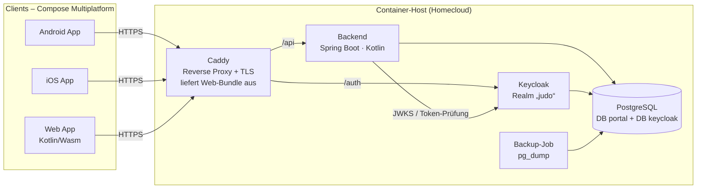
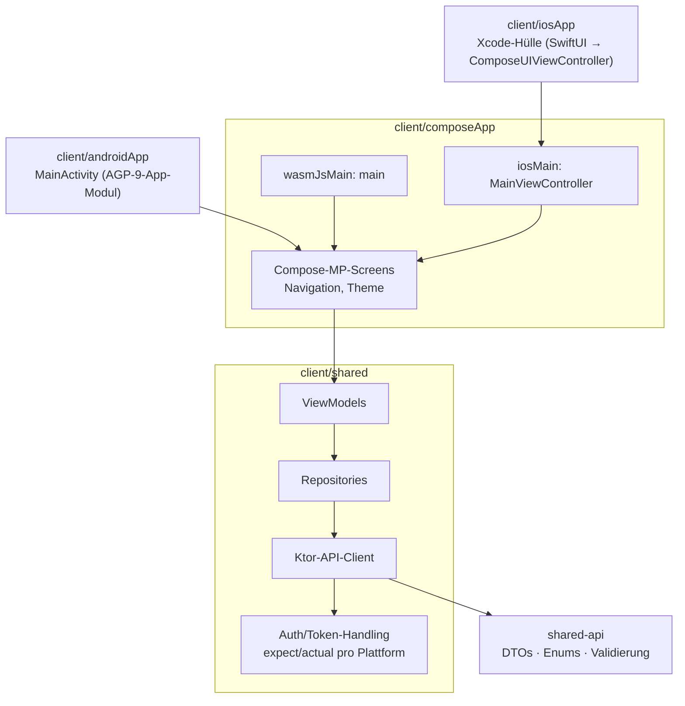

# Architektur – judo-portal

> Status: **beschlossen** (Oktober 2026). Begründungen für die einzelnen Entscheidungen
> stehen in den [ADRs](adr/).

## 1. Ziel & Rahmenbedingungen

| | |
|---|---|
| Zielgruppe | Mitglieder und Funktionäre (Vorstand, Kasse, Übungsleiter) eines Judo-Vereins |
| Größe | < 300 Mitglieder. Daten kommen per einmaligem Import aus Excel/CSV, eine laufende Schnittstelle zu Fremdsoftware gibt es nicht |
| Plattformen | Web, Android, iOS. Alles hinter einem Login |
| Initiale Features | Mitglieder- und Benutzerverwaltung · Events (Trainings & Veranstaltungen) · Übungsleiterabrechnung |
| Betrieb | Zunächst in einer container-basierten Homecloud. Auf jeden Container-Host übertragbar |
| Leitlinien | Eine Sprache (Kotlin) für alle Teile · wenig bewegliche Teile · DSGVO-konform · Komponenten so gewählt, dass auch ehrenamtliche Betreuer damit zurechtkommen |

## 2. Systemüberblick



**Ablauf Login & API-Aufruf**

1. Der Client startet den OIDC-Flow *Authorization Code + PKCE* gegen Keycloak
   (System-Browser bzw. Custom Tab auf Mobile, Redirect im Web).
2. Keycloak stellt Access- und Refresh-Token aus. Der Access-Token (JWT) enthält die
   Realm-Rollen.
3. Der Client ruft `/api/...` mit `Authorization: Bearer <token>` auf.
4. Das Backend prüft den JWT (Signatur über die JWKS von Keycloak), mappt die Rollen auf Spring
   Authorities und wendet die fachlichen Berechtigungsregeln an.

## 3. Technologie-Stack

Konkrete Versionen werden im Gradle Version Catalog (`gradle/libs.versions.toml`)
festgelegt. Dort steht immer die aktuelle stabile Version, Updates kommen über Dependabot.

| Bereich | Wahl | Anmerkung |
|---|---|---|
| Sprache | Kotlin | Backend, gemeinsamer Code und UI |
| JVM | **Java 25 LTS** | Gradle-Toolchain und Laufzeit-Image (`eclipse-temurin:25-jre`) |
| Build | Gradle (Kotlin DSL), Monorepo | Version Catalog `gradle/libs.versions.toml`. Convention Plugins (`build-logic/`) erst, wenn sich Build-Logik spürbar wiederholt |
| Backend | Spring Boot, Spring Web MVC, Spring Security (OAuth2 Resource Server), Spring Data JPA, Bean Validation, springdoc-openapi | |
| Modularisierung | Spring Modulith | Modulgrenzen werden per Test erzwungen |
| Datenbank | PostgreSQL + Flyway | Schema nur über Migrationen |
| Identity | Keycloak (OIDC) | Login, Passwort-Reset, optional 2FA/Passkeys |
| Clients | Kotlin Multiplatform + Compose Multiplatform (Targets: Android, iOS, wasmJs) | Eine UI-Codebasis |
| Client-Bibliotheken | Ktor Client, kotlinx.serialization, kotlinx.datetime, Koin, AndroidX ViewModel & Navigation für Compose MP | |
| Geteilter API-Vertrag | KMP-Modul `shared-api` mit JVM-Target | Backend und Clients nutzen dieselben DTOs |
| Dokumente/Mail | OpenPDF (o. ä.) für Abrechnungsbelege, SMTP für Mails | Push-Benachrichtigungen kommen später |
| Tests | JUnit 5, Testcontainers (PostgreSQL, Keycloak), Spring Modulith Tests, kotlin.test | |
| Qualität | ktlint (über Spotless), Dependabot, später CodeQL | detekt folgt, sobald detekt 2 stabil ist (detekt 1.x unterstützt Kotlin 2.4 nicht) |
| CI/CD | GitHub Actions, Images in GHCR | iOS-Builds auf macOS-Runnern, Store-Veröffentlichung später |
| Betrieb | Docker Compose | Caddy, Backend, Keycloak, PostgreSQL, Backup |

## 4. Backend: modularer Monolith

Das Backend ist **eine** deploybare Spring-Boot-Anwendung, intern aber in fachliche Module
geschnitten. Die Module rufen sich nur über ihre öffentliche API (Package-Root) oder über
Domain-Events auf. Spring Modulith prüft das in einem Test.

| Modul | Verantwortung |
|---|---|
| `members` | Mitglieder (Stammdaten, Mitgliedschaft, Abteilung/Gruppe), Verknüpfung Mitglied ↔ Benutzerkonto, Import aus CSV/Excel |
| `events` | Events aller Art: Trainings (wiederkehrend), Wettkämpfe, Lehrgänge, Vereinsveranstaltungen. Gruppen, Termine, An-/Abmeldung, Anwesenheit |
| `billing` | Übungsleiterabrechnung: Stunden aus durchgeführten Trainings, Sätze, Abrechnungszeiträume, Freigabe-Workflow, Belege (PDF), Export für die Kasse |
| `shared` | Querschnitt: Security-Konfiguration, Fehlerbehandlung, Audit-Log, Zeit/Clock, gemeinsame Value Objects |

Beispiel für eine Modul-Kopplung über Events: Wenn ein Training als durchgeführt bestätigt wird,
veröffentlicht `events` ein `TrainingHeld`-Event. `billing` reagiert darauf und erfasst die Stunden
des Übungsleiters, ohne dass `events` von `billing` weiß.

Paketstruktur je Modul (Beispiel):

```
de.landsberger.judo.portal.backend.events
├── EventsApi.kt            ← öffentliche Schnittstelle des Moduls
├── TrainingHeld.kt         ← veröffentlichtes Domain-Event
├── internal/
│   ├── domain/             ← Entities, Value Objects, Regeln
│   ├── persistence/        ← JPA-Repositories
│   └── web/                ← REST-Controller (/api/events/...)
```

## 5. Clients: Kotlin Multiplatform



- Die **UI wird einmal** in Compose Multiplatform geschrieben und läuft auf Android, iOS und
  im Web (Kotlin/Wasm).
- **Plattformspezifisch** über `expect`/`actual` sind nur: der OIDC-Login (Browser-Flow,
  Redirect-Handling), die sichere Token-Ablage (Android Keystore, iOS Keychain, im Web
  ausschließlich im Speicher) sowie später Push-Benachrichtigungen.
- **`shared-api`** enthält die Request/Response-DTOs und einfache Validierungsregeln. Das Backend
  bindet das Modul über sein JVM-Target ein, deshalb gibt es keinen Drift zwischen Client und Server.
  Zusätzlich erzeugt springdoc eine OpenAPI-Beschreibung für Dritte.
- Die Web-App setzt einen aktuellen Browser mit WasmGC-Unterstützung voraus. Weil alles hinter
  einem Login liegt, spielt SEO keine Rolle.

## 6. Sicherheit & Berechtigungen

### 6.1 Rollen

Feste Realm-Rollen in Keycloak. Eine Person kann mehrere Rollen haben.

| Rolle | Zweck | Darf u. a. |
|---|---|---|
| `member` | Jedes Mitglied | eigene Daten sehen/ändern (soweit erlaubt), Events sehen, sich an-/abmelden |
| `trainer` | Übungsleiter | eigene Gruppen und Trainings verwalten, Anwesenheit erfassen, eigene Abrechnungen einreichen |
| `board` | Vorstand | alle Mitgliedsdaten pflegen, vereinsweite Events anlegen, Abrechnungen **fachlich freigeben** |
| `treasurer` | Kasse | Bankdaten einsehen, freigegebene Abrechnungen **auszahlen/exportieren** |
| `admin` | Technische Administration | Benutzerkonten, Rollenvergabe, Systemeinstellungen. **Keine** fachlichen Rechte |

Bei Abrechnungen gilt das Vier-Augen-Prinzip: Der Übungsleiter reicht ein, der Vorstand gibt
frei, die Kasse zahlt aus. Wer eine Abrechnung eingereicht hat, kann sie nicht selbst freigeben.

### 6.2 Grundsätze

- **Keycloak authentifiziert, das Backend autorisiert.** Grobe Rollen kommen aus dem JWT.
  Fachliche Regeln (z. B. „Trainer sieht nur Mitglieder seiner Gruppen“) prüft das Backend
  (Method Security und Domain-Checks).
- Clients sind *public clients* mit PKCE und haben kein Client-Secret. Kurzlebige Access-Tokens,
  Refresh-Token-Rotation.
- Alle Verbindungen laufen über TLS (Caddy). Intern spricht nur Caddy mit der Außenwelt.
- Secrets (DB-Passwörter, SMTP, Keycloak-Admin) liegen als Umgebungsvariablen bzw.
  Docker-Secrets vor und stehen nie im Repo.

### 6.3 Datenschutz (DSGVO)

- **Datenminimierung:** Erfasst wird nur, was für Mitgliedschaft, Training und Abrechnung nötig ist.
- **Feldsicht nach Rolle:** Bankdaten nur für `treasurer` (und das Mitglied selbst). Sensible
  Angaben (z. B. Gesundheitshinweise für Trainer) nur bei ausdrücklichem Bedarf und mit Einwilligung.
- **Audit-Log** für Änderungen an Mitglieds- und Abrechnungsdaten (wer, wann, was).
- **Betroffenenrechte:** Export der eigenen Daten, Löschung bzw. Anonymisierung nach Austritt
  unter Beachtung der Aufbewahrungsfristen (Abrechnungen).
- **Verschlüsselte Backups**, Aufbewahrung mit Rotation.

## 7. Betrieb

### 7.1 Deployment

Alle Komponenten laufen als OCI-Container per Docker Compose:

| Container | Aufgabe |
|---|---|
| `caddy` | Reverse Proxy, automatisches TLS, liefert die Web-App (statische Wasm/JS-Dateien) aus, routet `/api` → Backend und `/auth` → Keycloak |
| `backend` | Spring-Boot-Anwendung |
| `keycloak` | Identity Provider. Realm-Konfiguration als `infra/keycloak/realm-judo.json` versioniert |
| `postgres` | Getrennte Datenbanken `portal` und `keycloak` |
| `backup` | Regelmäßiger `pg_dump`, verschlüsselt, mit Rotation |

### 7.2 Homecloud

- Die mobilen Apps brauchen eine **öffentlich per HTTPS erreichbare Domain**. Möglich ist
  DynDNS mit Portfreigabe (443) oder ein Tunnel (z. B. Cloudflare Tunnel). Die
  Entscheidung fällt beim Deployment-Schritt.
- Health-Checks über Spring Boot Actuator (`/actuator/health`, nur intern erreichbar).
- Ein späterer Umzug auf einen EU-VPS oder in eine Managed-Umgebung braucht nur ein anderes
  Compose-File bzw. andere Manifeste, die Images bleiben dieselben.

### 7.3 Umgebungen

| Umgebung | Zweck |
|---|---|
| `dev` | Lokal mit Podman oder Docker: `infra/compose.dev.yaml` (PostgreSQL auf 5432, Keycloak auf 8081 mit Realm `judo` und Testnutzern je Rolle, siehe [`infra/README.md`](../infra/README.md)). Backend und Clients laufen aus der IDE bzw. per Gradle |
| `prod` | Homecloud |

## 8. Repository-Struktur

```
judo-portal/
├── backend/               Spring-Boot-App (Module: members, events, billing, shared)
├── shared-api/            KMP: DTOs, Enums, Validierung (jvm, android, ios, wasmJs)
├── client/
│   ├── shared/            KMP: API-Client, Auth, Repositories, ViewModels
│   ├── composeApp/        Compose-MP-UI (Android-Library, iOS-Framework, Web-App)
│   ├── androidApp/        Android-App-Modul (MainActivity, Manifest, App-Name)
│   └── iosApp/            Xcode-Projekt (Hülle für iOS, folgt in Schritt 5)
├── gradle/libs.versions.toml
├── infra/
│   ├── compose.dev.yaml   lokale Dev-Umgebung (Postgres + Keycloak)
│   ├── compose.prod.yaml  Produktion (Schritt 9)
│   ├── Caddyfile          (Schritt 9)
│   ├── postgres/init/     Anlage der DBs portal + keycloak
│   ├── keycloak/          realm-judo-dev.json (Testnutzer), später realm-judo.json (Prod)
│   └── scripts/           smoke-test.sh
├── docs/
│   ├── ARCHITECTURE.md
│   └── adr/
└── CLAUDE.md              Build-/Test-Befehle und Konventionen
```

### Packages & Namen

| Modul | Basis-Package |
|---|---|
| `backend` | `de.landsberger.judo.portal.backend` (Modulith-Module als direkte Unterpakete) |
| `shared-api` | `de.landsberger.judo.portal.api` |
| `client/shared` | `de.landsberger.judo.portal.client` |
| `client/composeApp` | `de.landsberger.judo.portal.ui` |
| `client/androidApp` | `de.landsberger.judo.portal` (= `applicationId`) |

App-Name auf allen Plattformen: **WTSV Judo**.

Die Android-Clients nutzen das JVM-Target von `shared-api`. Deshalb kompilieren `shared-api` und
die Android-Teile auf Java-21-Bytecode, das Backend auf Java 25.

## 9. Roadmap

Wir gehen in kleinen Schritten vor. Jeder Schritt bekommt einen eigenen Plan, die Rückfragen
werden vorher geklärt.

| # | Schritt | Ergebnis |
|---|---|---|
| 1 ✅ | Architektur-Doku | Dieses Dokument und die ADRs |
| 2 ✅ | Repo-Skelett | Gradle-Monorepo, Version Catalog, leere Module, CI (Build + Lint) |
| 3 ✅ | Lokale Infrastruktur | `infra/compose.dev.yaml` mit PostgreSQL + Keycloak und Testnutzern |
| 4 | Backend-Durchstich | Security-Konfiguration, `GET /api/me`, Flyway-Basis, Testcontainers-Test |
| 5 | Client-Durchstich | Login (PKCE) und Anzeige von `/api/me` auf Android, Web und iOS |
| 6 | Feature: Mitgliederverwaltung | eigene Planung |
| 7 | Feature: Events | eigene Planung |
| 8 | Feature: Übungsleiterabrechnung | eigene Planung |
| 9 | Produktiv-Deployment Homecloud | eigene Planung |

## 10. Offene Punkte

- Laufzeitumgebung der Homecloud (Docker Compose, Portainer, k3s, Unraid/Synology …) und
  Domain bzw. Erreichbarkeit von außen. Wird in Schritt 9 geklärt, die Compose-Basis entsteht in Schritt 3.
- Fachliches für die Feature-Planung: Familien-/Elternkonten für Kinder,
  Gürtel- und Prüfungshistorie, Abrechnungsregeln (Stundensätze, Freibetrag nach § 3 Nr. 26 EStG).
- Veröffentlichung in den App-Stores (Apple-Developer- und Google-Play-Konto des Vereins).
